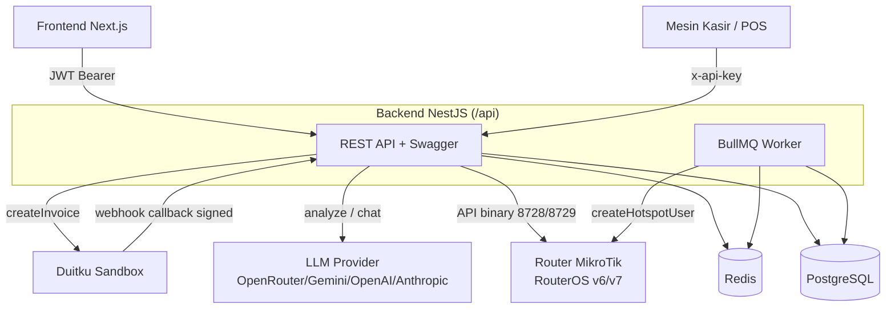
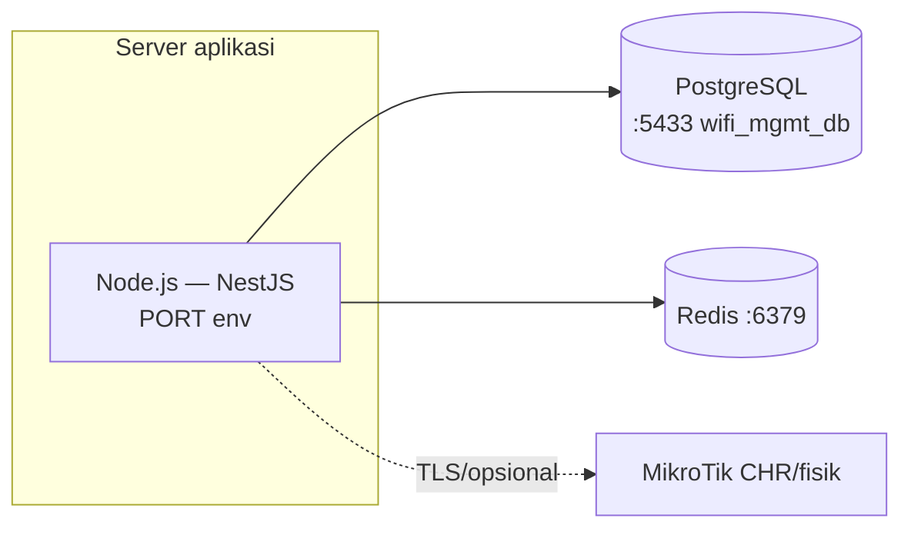
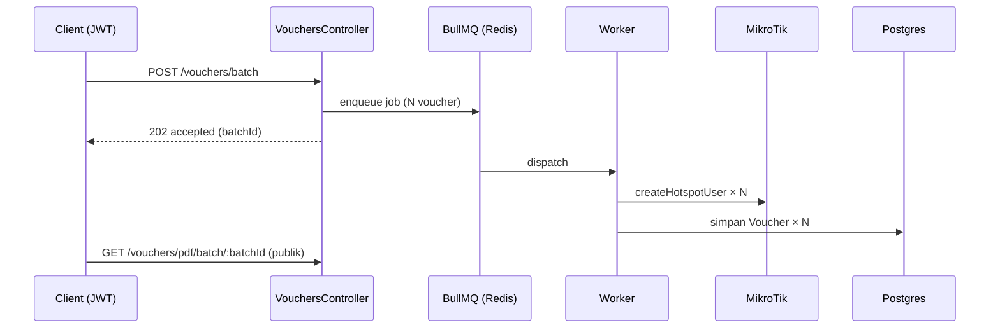
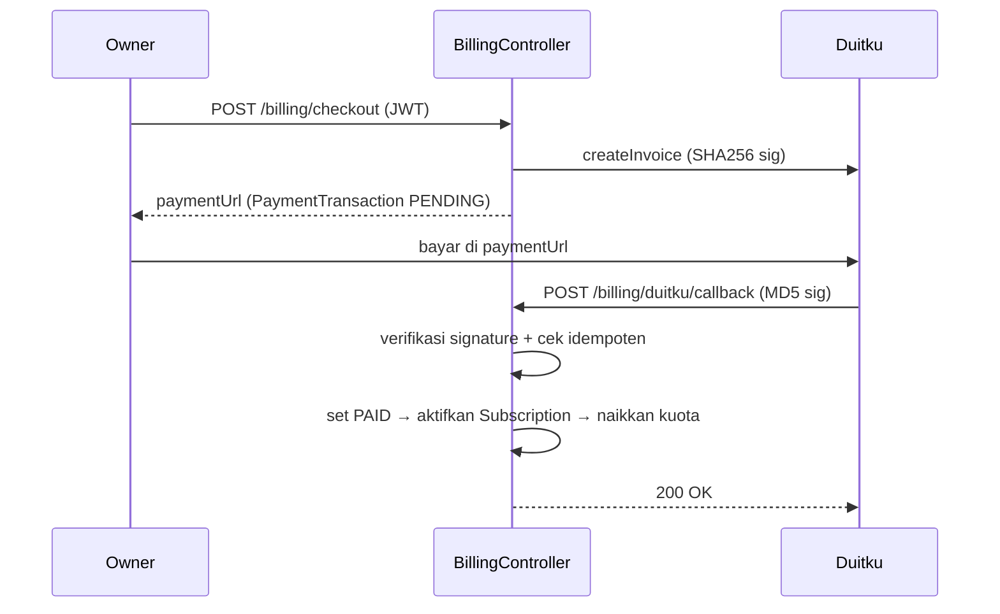
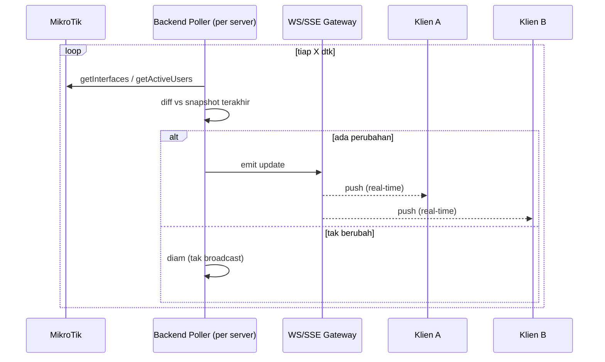

# ARSITEKTUR — Arsitektur Sistem (Backend)

**Produk:** P5 — Web Management WiFi untuk FnB · **Cakupan:** Backend (NestJS API)
**Versi:** 1.0 · **Tanggal:** 2026-07-06
**Referensi:** [`PRD.md`](./PRD.md) · [`SRS.md`](./SRS.md) · [`SDD.md`](./SDD.md) · [`../BACKEND.md`](../BACKEND.md)

---

## 1. Gambaran Umum

Backend adalah **monolith modular NestJS** ber-prefix `/api`, stateless terhadap router (koneksi
per operasi), didukung PostgreSQL (data) + Redis (antrean). Terintegrasi 4 sistem eksternal:
router MikroTik, LLM provider, Duitku (pembayaran), dan mesin POS.

---

## 2. Diagram Konteks Sistem



---

## 3. Lapisan (Layered Architecture)

```
┌───────────────────────────────────────────────┐
│ Presentation   Controller + DTO (class-validator) + Swagger │
├───────────────────────────────────────────────┤
│ Cross-cutting  JwtAuthGuard · RolesGuard · ValidationPipe   │
│                Throttler · helmet · CORS · @CurrentUser      │
├───────────────────────────────────────────────┤
│ Business       Service (scope.util, effectiveOwnerId,        │
│                assertOwnerAccess, buildChatContext, billing)  │
├───────────────────────────────────────────────┤
│ Integration    MikrotikService · DuitkuService · LLM client  │
│                crypto.util (AES-256-GCM) · BullMQ producer    │
├───────────────────────────────────────────────┤
│ Data           PrismaService (@prisma/adapter-pg) → Postgres │
└───────────────────────────────────────────────┘
```

Modul `@Global`: `prisma` (PrismaService) & `mikrotik` (MikrotikService) — dipakai lintas modul.
`ConfigModule` global memuat config `app/database/jwt/redis/ai`.

---

## 4. Komponen & Tanggung Jawab

| Komponen | Tanggung jawab |
|----------|----------------|
| `main.ts` | Bootstrap: prefix `/api`, `ValidationPipe` global, helmet, CORS, Swagger `/api/docs` |
| `auth` | Login JWT, `JwtStrategy`, guard (`JwtAuthGuard`,`RolesGuard`), `@Roles`,`@CurrentUser` |
| `users` | CRUD user, invariant Owner↔Teknisi, anti privilege-escalation |
| `servers` | CRUD router, enkripsi kredensial, test koneksi, penegakan kuota |
| `profiles` | CRUD hotspot profile + sync dari/ke router (transaksional) |
| `vouchers` | Generate single/batch (BullMQ), PDF/QR, bulk delete |
| `monitoring` | Active users, resource, traffic (polling) |
| `ai` | Analyze config + chat kontekstual (context builder, multi-provider LLM) |
| `billing` | Plan, Subscription, kuota, Duitku checkout+callback |
| `activity-log` | Pencatatan & query log ter-scope |
| `pos` | Trigger voucher dari POS via API key per-outlet (idempoten) + CRUD `pos-keys` |
| `mikrotik` | Integrasi RouterOS API binary (connect→write→close) |
| `prisma` | Akses DB |

---

## 5. Model Deployment



- Prasyarat runtime: **PostgreSQL** aktif, **Redis** aktif (BullMQ), MikroTik dengan **API service aktif**
  (`/ip/service` → `api`/`api-ssl`).
- Proses: `npm run start:dev` (watch) / `npm run build` + `start:prod`.
- BullMQ worker berjalan dalam proses yang sama (in-process) memakai Redis sebagai broker.

> Catatan teknis: `start:prod` di `package.json` menunjuk `node dist/main` — path benar `node dist/src/main.js` (pre-existing).

---

## 6. Alur Data Kunci

### 6.1 Generate Voucher Batch (async)


### 6.2 Pembayaran Duitku (webhook idempoten)


---

## 7. Keamanan Arsitektural (defense-in-depth)

1. **Edge** — `helmet`, CORS `FRONTEND_URL`, `@nestjs/throttler` (login 5/mnt, AI analyze 10/jam, chat 20/mnt, default 100/mnt).
2. **Autentikasi** — JWT (`JWT_SECRET` fail-fast) untuk user; `x-api-key` (hash sha256) untuk POS; signature MD5 untuk webhook Duitku.
3. **Otorisasi** — `RolesGuard` default-deny + scoping per-owner di service layer (anti kebocoran tenant).
4. **Data at-rest** — kredensial router AES-256-GCM, password user bcrypt.
5. **Integritas transaksi** — idempotensi via `merchantOrderId`/`transactionId` unik; webhook verifikasi sebelum mutasi DB.

---

## 8. Kualitas Atribut (Quality Attributes)

| Atribut | Pendekatan arsitektural |
|---------|-------------------------|
| Skalabilitas | Beban berat (batch) di-offload ke BullMQ; koneksi router stateless |
| Ketersediaan | Router offline di-`try/catch` (chat/monitoring tak fatal) |
| Keamanan | Lihat §7 (berlapis) |
| Multi-tenancy | Scoping `ownerId` konsisten di semua modul |
| Portabilitas router | Dukungan RouterOS v6 & v7 (patch reply `!empty`) |
| Ekstensibilitas LLM | Dispatch multi-provider (`callLLM`) |
| Observability | `ActivityLog` terpusat + Swagger |

---

## 9. Titik Integrasi Eksternal

| Sistem | Protokol | Auth | Modul |
|--------|----------|------|-------|
| MikroTik | RouterOS API binary (8728/8729-TLS) | Basic (kredensial per-server, AES) | `mikrotik` |
| LLM | HTTPS REST | API key env | `ai` |
| Duitku | HTTPS REST + webhook | signature SHA256/MD5 | `billing` |
| POS | HTTPS REST | `x-api-key` (sha256, per-outlet) | `pos` |
| Frontend | HTTPS REST | JWT Bearer | semua |

---

## 10. Keterbatasan & Arah Lanjut

- **Monitoring** masih polling (target real-time <5 dtk) → kandidat pola **hybrid push** (lihat §10.1).
- **Histori trafik** belum dipersist (hanya realtime).
- BullMQ worker in-process → dapat dipisah ke worker terdedikasi bila beban naik.
- **POS** membuat voucher langsung (tak lewat `VouchersService`) & tanpa `quantity` (1 request = 1 voucher) — konsolidasi jalur voucher bisa jadi peningkatan berikutnya.

### 10.1 Arah Lanjut Monitoring — Pola Hybrid (polling router + push ke klien)

RouterOS API **tidak** mengirim notifikasi otomatis saat traffic/user berubah, sehingga push
end-to-end murni tidak mungkin dari sisi router. Solusi yang direkomendasikan memisah 2 lapis:

| Lapis | Mekanisme | Alasan |
|-------|-----------|--------|
| Backend ↔ MikroTik | **polling terpusat** (1 poller per server, interval X dtk) + **diff** vs snapshot sebelumnya | Router tak bisa push; poll terpusat agar N klien tak menggandakan beban ke router |
| Backend ↔ Klien | **push** via **WebSocket/SSE** — kirim **hanya saat data berbeda** (event-driven) | Latensi <5 dtk, hemat (tak ada response "tidak berubah" berulang) |



**Keuntungan vs polling per-klien saat ini:** beban router konstan (tak naik seiring jumlah klien),
klien menerima update <detik hanya saat benar-benar berubah. **SSE** cukup bila arah data hanya
server→klien (kasus monitoring); **WebSocket** bila butuh 2 arah. Perlu tambahan: Nest WebSocket/SSE
gateway + penyimpanan snapshot terakhir (in-memory/Redis) untuk diff.
