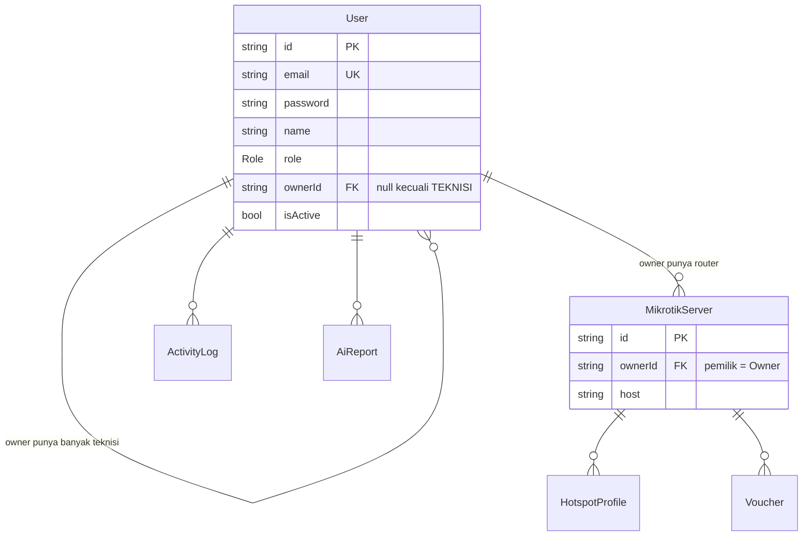

# todo_backendp.md — TODO Backend Pribadi (Hasil Mentoring)

**Proyek:** Web Management WiFi / Monitoring Router MikroTik untuk FnB (P5)
**Peran saya:** Senior Backend Engineer — **fokus penuh sisi backend**.
**Sumber:** to-do list hasil sesi mentoring + audit kode existing.
**Tanggal disusun:** 2026-06-27.

> Dokumen ini melengkapi [`doc/BACKEND.md`](./BACKEND.md)
> (arsitektur). Di sini khusus 4 pilar **baru** dari mentoring: **RBAC**, **AI Widget**,
> **Billing/Kuota + Duitku**, dan **Dokumentasi API**.

**Legenda:** `[ ]` Belum mulai · `[~]` Dalam proses · `[x]` Selesai · `(B)` butuh migrasi DB · `(SEC)` sensitif keamanan

---

## 0. Kondisi Kode Saat Ini (baseline dari audit)

Penting dipahami sebelum mulai — banyak fitur baru bergantung pada perubahan model ini:

| Area | Kondisi sekarang | Implikasi untuk tugas baru |
|------|------------------|----------------------------|
| **Auth & Role** | Hanya 1 model `Admin` (email, password bcrypt, `isActive`). **Belum ada konsep role sama sekali.** JWT payload = `{ sub, email }`. | RBAC harus ditambahkan dari nol: kolom `role`, guard role, mapping Owner↔Teknisi. |
| **Kepemilikan Router** | `MikrotikServer` **tidak punya** `ownerId`/`userId` — semua router bersifat global. | Perlu relasi kepemilikan agar Owner/Teknisi/Super Admin bisa difilter. |
| **AI** | `ai.service.ts` hanya `analyzeServer()` (tarik config → LLM → simpan `AiReport`). **Belum ada endpoint chat** & belum ada injeksi log per-user. `AiController` sudah pakai `JwtAuthGuard`. | Buat endpoint chat baru + context builder dari log DB. |
| **Billing** | **Tidak ada** model paket/langganan/transaksi billing. | Bangun dari nol (Plan, Subscription, PaymentTransaction). |
| **POS** | `PosApiKey` & `PosTransaction` sudah ada di schema + modul `pos`. | Tidak termasuk scope mentoring ini, jangan diutak-atik. |
| **Log** | `ActivityLog` (aksi sistem) sudah ada. Log trafik TX/RX router **belum dipersist** (monitoring masih realtime polling, tidak disimpan). | Owner butuh "lihat log trafik TX/RX" → kemungkinan perlu tabel histori trafik/status. |

> ⚠️ Keputusan desain kunci yang masih menunggu diskusi (lihat §6 Open Questions)
> menentukan bentuk akhir migrasi. Jangan migrasi DB sebelum desain RBAC disepakati.

---

## A. Manajemen Role / RBAC (3 Role)

**Role:** `SUPER_ADMIN`, `OWNER`, `TEKNISI`.
**Status endpoint Teknisi:** logika CRUD inti (server/profile/voucher) **sudah ada** —
tinggal dilindungi guard role.

### A.1 Desain Database & Relasi (PRIORITAS PERTAMA) — ✅ SELESAI (migrasi + seed jalan)

> ERD + skema Prisma lengkap di **§H**. Migrasi: `20260627155930_rbac_roles_ownership`.
> Catatan: DB lama di-**reset** (drift + `MIKROTIK_ENC_KEY` hilang) → backup di `backups/*.sql`,
> jadi `ownerId` langsung `NOT NULL` (tak perlu 3-langkah karena tabel kosong).

- [x] (B) enum `Role { SUPER_ADMIN, OWNER, TEKNISI }`.
- [x] (B) Refactor `Admin` → `User` + kolom `role` (Q1 ✅). Relasi `adminId`→`userId` di ActivityLog & AiReport.
- [x] (B) Relasi Owner↔Teknisi = self-relation `User.ownerId` (Q2 ✅, 1 Teknisi : 1 Owner, onDelete Cascade).
- [x] (B) `MikrotikServer.ownerId` NOT NULL + FK ke User.
- [x] Buat ERD final + dokumentasikan → §H.
- [x] Seed 3 role: admin@/owner@/teknisi@ (lihat §J).

### A.2 Infrastruktur RBAC (NestJS) — ✅ SELESAI (file dibuat, kode di §I)
- [x] `auth/decorators/roles.decorator.ts` — `@Roles()` + `ROLES_KEY`.
- [x] `auth/guards/roles.guard.ts` — `RolesGuard`, **403** saat role kurang.
- [x] `common/scope.util.ts` — `serverScopeWhere()` + `effectiveOwnerId()`.
- [x] Part B: `role`+`ownerId` ke JWT payload (`auth.service.login`) & `JwtStrategy` select+validate.
- [x] Pasang `@UseGuards(JwtAuthGuard, RolesGuard)` + `@Roles` di semua controller (servers, profiles, vouchers, monitoring, ai, activity-log). Scoping via `serverScopeWhere` / `assertOwnerAccess` di service. + helper `canAccessOwner`/`assertOwnerAccess` ditambah ke `scope.util.ts`.

### A.3 Aturan Akses per Role — ✅ SELESAI (terverifikasi runtime, lihat §K)
- [x] **Super Admin:** akses global semua router (scoping `{}`) di semua controller.
- [x] **Teknisi:** endpoint config (servers/profiles/vouchers/ai/monitoring non-traffic) `@Roles('TEKNISI','SUPER_ADMIN')` + scoping ke router milik Owner-nya.
- [x] **Owner (read-only):**
  - [x] `GET /monitoring/traffic/:serverId` (TX/RX) — Owner diizinkan, ter-scope.
  - [x] `GET /activity-log` — riwayat aktivitas/offline router miliknya (`ROUTER_CONNECTION_FAILED`, dll).
  - [x] **BLOKIR** semua config (servers mutasi, profiles, vouchers, ai, monitoring active/resources) → **403**.
- [x] (SEC) Audit: semua controller config kini lewat `RolesGuard`. (PDF voucher tetap publik by design.)

### A.4 Manajemen User — ✅ SELESAI (modul `users`, terverifikasi runtime)
- [x] `POST/GET/GET:id/PATCH/DELETE /api/users` — guard `@Roles('OWNER','SUPER_ADMIN')`, TEKNISI 403.
- [x] OWNER buat/kelola **Teknisi miliknya** (role dipaksa TEKNISI, ownerId auto). Cegah privilege escalation.
- [x] SUPER_ADMIN buat OWNER/TEKNISI (TEKNISI wajib ownerId valid), lihat semua. Buat SUPER_ADMIN via API ditolak.
- [x] Proteksi: tak bisa nonaktif/hapus diri sendiri; email duplikat → 400.
- [x] Seed: 1 SUPER_ADMIN default (+ OWNER & TEKNISI demo).
- [x] Dokumentasi → `doc/api/rbac.md` §Manajemen User.
- Catatan: aksi user belum di-`ActivityLog` (belum ada enum `USER_*`) — follow-up kecil.

---

## B. Fitur AI — Floating Widget Chat (kontekstual) — ✅ SELESAI & TERVERIFIKASI (2026-06-29)

**Tujuan:** endpoint chat yang, sebelum memanggil LLM, **menyuntik log router milik user**
ke dalam *system prompt* agar jawaban akurat sesuai kondisi jaringan user.

### B.1 Model & Skema — ✅ (migrasi `20260629132520_ai_chat_sessions`)
- [x] Model `AiChatSession` (`userId`, `serverId?`, `title`) + `AiChatMessage` (`role` USER/ASSISTANT, `content`) + enum `ChatRole`. Multi-turn.
- [x] Relasi: `user onDelete Cascade`, `server onDelete SetNull`, `message onDelete Cascade`.

### B.2 Logika & Konteks — ✅
- [x] (B) Sumber konteks (Q3 ✅) = `ActivityLog` (15 terbaru) + daftar router & status + `AiReport` terakhir (2000ch) + konfig live (`getFullConfig`, 4000ch) bila `serverId`.
- [x] `POST /api/ai/chat` — body `{ question, serverId?, sessionId? }`, dilindungi `JwtAuthGuard`+`RolesGuard`. DTO validasi (question 1–2000).
- [x] **context builder** `buildChatContext()`: ambil data milik user (scoped role/owner) → ringkas → teks konteks. Tarik konfig live di-`try/catch` (router offline tak menggagalkan chat).
- [x] *system prompt*: persona network expert + blok konteks + riwayat + pertanyaan user.
- [x] Reuse provider LLM via `callLLM()` (dispatch `callGemini/callOpenRouter/callOpenAI/callAnthropic`, default env `LLM_PROVIDER`).
- [x] Batasi ukuran konteks: truncate (report 2000ch, konfig 4000ch, router maks 20, log 15).
- [x] (SEC) Scoping: konteks **hanya** router milik user (`serverScopeWhere` + `assertOwnerAccess`) → router Owner lain 403, tak ada 404.
- [x] Throttle `POST /ai/chat` 20/menit/IP (`@Throttle`).
- [x] Simpan riwayat percakapan (multi-turn) — transaksional **setelah** LLM sukses (gagal LLM → tak ada data tersimpan).
- [x] Owner boleh pakai chat (Q5 ✅, read-only context, semua role) — `@Roles('OWNER','TEKNISI','SUPER_ADMIN')`.
- [x] Endpoint pelengkap: `GET /ai/chat/sessions`, `GET /ai/chat/sessions/:id`, `DELETE /ai/chat/sessions/:id` (kepemilikan per `userId` → sesi user lain 404).

### B.3 Uji menyeluruh — ✅ 24/24 LULUS (2026-06-29)
Auth/validasi/scoping serverId/LLM-tercapai(semua role)/kepemilikan sesi/efek-samping(gagal LLM tak menyimpan)/hapus → `doc/api/ai-chat-test-results.md`.
> Catatan: API key LLM di `.env` kosong → jalur jawaban LLM sukses (201) diuji terpisah setelah user isi key; semua guard/scoping/sesi terbukti tanpa key.

---

## C. Sistem Billing & Limitasi Kuota + Duitku

**Tujuan:** paket langganan membatasi jumlah router; pembayaran via **Duitku (Sandbox)**;
webhook memvalidasi signature lalu update status & kuota.

### C.1 Model & Skema (B) — ✅ SELESAI (migrasi `20260628061332_billing_plans_subscriptions`)
- [x] (B) Model `Plan`: `code`(FREE/STANDARD), `name`, `maxRouters`, `price`, `durationDays`, `isActive`. Seed: Gratis(1)/Standar(5, Rp50.000/30hr).
- [x] (B) Model `Subscription`: `userId`, `planId`, `status`, `startedAt`, `expiredAt`. (Q4 ✅ source of truth.)
- [x] (B) Model `PaymentTransaction`: `merchantOrderId`(unik), `amount`, `status`, `duitkuReference`, `paymentUrl`, `paymentMethod`, `paidAt`.
- [x] (B) Q4 ✅ → kuota & expiry diturunkan dari `Subscription` aktif (fallback FREE). + enum LogAction billing.

### C.2 Logika Validasi Kuota — ✅ SELESAI (terverifikasi)
- [x] `ServersService.create` panggil `BillingService.assertCanAddRouter(ownerId)` → kuota penuh **403**.
- [x] Tolak bila langganan kadaluarsa (`expiredAt < now`) → 403.
- [x] Owner baru auto langganan FREE (`ensureFreeSubscription`, dipanggil saat buat Owner + seed).

### C.3 Integrasi Duitku (Sandbox) — ✅ SELESAI
- [x] Env Duitku di `.env`/`.env.example` (MERCHANT_CODE, API_KEY, BASE_URL, CALLBACK_URL, RETURN_URL).
- [x] `POST /api/billing/checkout` (OWNER) → `DuitkuService.createInvoice` (SHA256 header sig) → simpan `PaymentTransaction(PENDING)` → `paymentUrl`. Tanpa creds → 503.
- [x] (SEC) Signature checkout SHA256(merchantCode+timestamp+apiKey); callback MD5(merchantCode+amount+merchantOrderId+apiKey).

### C.4 Webhook / Callback (SEC) — ✅ SELESAI (terverifikasi)
- [x] `POST /api/billing/duitku/callback` — TANPA JWT, body form-urlencoded.
  - [x] (SEC) Validasi signature (MD5, `crypto.timingSafeEqual`) → invalid **403**, data tak diubah.
  - [x] Idempoten: tx `PAID` → skip (terbukti replay tak dobel).
  - [x] Set `PaymentTransaction.status` → `PAID` + `paidAt`.
  - [x] Aktifkan langganan: expire lama → buat baru `ACTIVE` (`expiredAt = now+durationDays`) → batas router ikut `plan.maxRouters` (terbukti 1→5).
  - [x] Catat `ActivityLog` (`PAYMENT_RECEIVED`, `SUBSCRIPTION_ACTIVATED`).
- [~] Return URL: hanya env `DUITKU_RETURN_URL` (halaman hasil = tugas frontend).
- [x] Uji simulasi callback (signature valid/invalid + idempotensi) via cURL.

### C.5 Uji menyeluruh — ✅ 33/33 LULUS (2026-06-29)
Plans/me/kuota/checkout-guard/callback(signature+idempoten+aktivasi)/upgrade/expiry → `doc/api/billing-test-results.md`.

### C.6 Perbaikan deteksi kadaluarsa — ✅ SELESAI (2026-06-29)
- [x] `getEffectiveLimit` tandai `expired`/`expiredPlanName` bila langganan **berbayar** lewat masa berlaku.
- [x] `assertCanAddRouter` tolak eksplisit (didahulukan dari cek kuota) → pesan "Langganan {paket} kadaluarsa ({tgl}). Perpanjang…".
- [x] `GET /billing/me` ekspos field `expired` & `expiredPlanName`.
- [x] Terverifikasi: kadaluarsa→403 pesan kadaluarsa · STANDARD aktif→201 · FREE penuh→tetap "kuota penuh" (regresi aman).

---

## D. Dokumentasi API (Markdown) — wajib tiap endpoint

Format wajib per endpoint: **Method, URL, Request Payload, Response (Success & Error)**.

- [x] Buat `doc/api/rbac.md` — auth (login/me) + matriks akses per role + contoh 403/401. ✅
- [x] Buat `doc/api/ai-chat.md` — endpoint AI chat widget (+ `doc/api/ai-chat-test-results.md` 24/24). ✅
- [x] Buat `doc/api/billing.md` — plans, me, checkout, callback Duitku, penegakan kuota. ✅
- [x] Update `doc/BACKEND.md` (modul, tabel endpoint users/billing/ai-chat, skema RBAC/billing/chat, env Duitku) & `.env.example` (+`OPENROUTER_API_KEY`). ✅ (2026-06-29)
- [x] Dekorator Swagger (`@ApiOperation`, `@ApiResponse`, `@ApiTags`, `@ApiBearerAuth`) terpasang di controller `users`/`billing`/`ai` (chat) → `/api/docs` sinkron. ✅

---

## E. Urutan Pengerjaan yang Disarankan

1. **RBAC dulu** (A.1 → A.2 → A.3). Hampir semua fitur lain (scoping AI & kuota billing) bergantung pada konsep user/role/kepemilikan router. **Mulai dari desain relasi Owner↔Teknisi.**
2. **Billing & Kuota** (C) — butuh konsep Owner & kepemilikan router dari langkah 1.
3. **AI Widget** (B) — butuh scoping role + sumber log dari langkah 1.
4. **Dokumentasi** (D) — ditulis **berbarengan** tiap endpoint selesai, bukan di akhir.

---

## F. Open Questions / Keputusan Desain Menunggu Konfirmasi

- **Q1.** ✅ **DIPUTUSKAN:** Refactor `Admin` → `User` (+ kolom `role`). Lebih bersih untuk 3 role;
  biaya sentuh ~6 file (auth.service, jwt.strategy, current-user, activity-log, ai.service, seed).
- **Q2.** ✅ **DIPUTUSKAN:** Relasi Owner↔Teknisi = **1 Teknisi milik 1 Owner** (self-relation
  `User.ownerId`). 1 Owner punya banyak Teknisi. Bukan many-to-many.
- **Q2b.** ✅ **DIPUTUSKAN:** Akun Teknisi **dibuat sendiri oleh Owner** (self-service);
  `ownerId` otomatis = Owner pembuat. Owner butuh endpoint manajemen Teknisi (tetap dilarang config router).
- **Q3.** ✅ **DIPUTUSKAN:** konteks AI = **gabungan** `ActivityLog` (15 terbaru) + daftar router & status +
  `AiReport` terakhir + konfig live (`getFullConfig`) bila `serverId` diisi. Tanpa tabel histori trafik baru.
- **Q4.** ✅ **DIPUTUSKAN:** kuota & `expiredAt` **diturunkan dari `Subscription` aktif** (normalized),
  fallback paket FREE bila tak ada langganan aktif.
- **Q5.** ✅ **DIPUTUSKAN:** **Semua role** boleh memakai AI chat (termasuk Owner read-only); konteks & sesi
  selalu ter-scope ke data milik user. Berbeda dari `POST /ai/servers/:id/analyze` yang khusus TEKNISI/SUPER_ADMIN.

---

## G. Catatan Keamanan (SEC) — checklist lintas fitur

- [ ] Semua endpoint config teknis WAJIB lewat `RolesGuard` (default-deny).
- [ ] Webhook Duitku **selalu** validasi signature + idempoten sebelum mengubah DB.
- [ ] AI context scoping ketat — tidak ada kebocoran data antar Owner/tenant.
- [ ] Secret Duitku & LLM hanya di `.env` (jangan commit), masuk `.env.example` tanpa nilai.
- [ ] Owner read-only: pastikan mutation (POST/PATCH/DELETE) config → 403.

---

## H. Desain RBAC — ERD & Skema (DESAIN OF RECORD)

Keputusan: Q1 ✅ refactor `Admin`→`User` · Q2 ✅ self-relation `ownerId` (1 Teknisi : 1 Owner) ·
Q2b ✅ Owner buat Teknisi sendiri.

### H.1 ERD



### H.2 Skema Prisma

```prisma
enum Role {
  SUPER_ADMIN
  OWNER
  TEKNISI
}

model User {
  id        String   @id @default(cuid())
  email     String   @unique
  password  String   // bcrypt
  name      String
  role      Role     @default(OWNER)
  isActive  Boolean  @default(true)

  ownerId     String?  // diisi hanya untuk TEKNISI
  owner       User?    @relation("OwnerTechnicians", fields: [ownerId], references: [id], onDelete: Cascade)
  technicians User[]   @relation("OwnerTechnicians")

  servers   MikrotikServer[]
  logs      ActivityLog[]
  aiReports AiReport[]

  createdAt DateTime @default(now())
  updatedAt DateTime @updatedAt

  @@index([ownerId])
  @@index([role])
  @@map("users")
}

// MikrotikServer: tambah
//   ownerId String
//   owner   User @relation(fields: [ownerId], references: [id], onDelete: Cascade)
//   @@index([ownerId])
```

### H.3 Invariant (ditegakkan di service)

| role | `ownerId` | punya `servers` |
|------|-----------|-----------------|
| SUPER_ADMIN | null | ❌ |
| OWNER | null | ✅ |
| TEKNISI | wajib | ❌ (akses via owner) |

### H.4 Scoping query

- SUPER_ADMIN → tanpa filter.
- OWNER → router `where ownerId = me.id`.
- TEKNISI → router `where ownerId = me.ownerId`.

### H.5 Catatan migrasi (ada data lama)

1. `MikrotikServer.ownerId` required → migrasi **3 langkah**: nullable → backfill ke Owner default → NOT NULL.
2. Rename relasi `ActivityLog.adminId`/`AiReport.adminId` repoint ke `User` (opsi rename → `userId`).
3. `onDelete: Cascade` self-relation: hapus Owner = hapus Teknisi + router-nya (cleanup tenant, disengaja).
4. Seed: 1 SUPER_ADMIN + 1 OWNER default (pemilik router lama saat backfill).

---

## I. Desain Infra RBAC (A.2) — KODE OF RECORD

4 file baru + 2 edit (Part B saat A.1). `Role` di-import dari `@prisma/client` →
file baru compile **setelah** A.1 (`prisma generate`).

**Keputusan:** guard per-controller `@UseGuards(JwtAuthGuard, RolesGuard)` (bukan global) ·
tanpa `@Roles` = izin (cuma butuh JWT) → endpoint config WAJIB `@Roles` (lihat audit §G) ·
RolesGuard lempar **403** (bukan 401).

### I.1 `auth/decorators/roles.decorator.ts`
```ts
import { SetMetadata } from '@nestjs/common';
import { Role } from '@prisma/client';

export const ROLES_KEY = 'roles';
export const Roles = (...roles: Role[]) => SetMetadata(ROLES_KEY, roles);
```

### I.2 `auth/guards/roles.guard.ts`
```ts
import { Injectable, CanActivate, ExecutionContext, ForbiddenException } from '@nestjs/common';
import { Reflector } from '@nestjs/core';
import { Role } from '@prisma/client';
import { ROLES_KEY } from '../decorators/roles.decorator.js';

@Injectable()
export class RolesGuard implements CanActivate {
  constructor(private reflector: Reflector) {}

  canActivate(context: ExecutionContext): boolean {
    const required = this.reflector.getAllAndOverride<Role[]>(ROLES_KEY, [
      context.getHandler(),
      context.getClass(),
    ]);
    if (!required || required.length === 0) return true;

    const { user } = context.switchToHttp().getRequest();
    if (!user || !required.includes(user.role)) {
      throw new ForbiddenException('Anda tidak punya hak akses untuk resource ini');
    }
    return true;
  }
}
```

### I.3 `common/scope.util.ts`
```ts
import { ForbiddenException } from '@nestjs/common';
import { Role } from '@prisma/client';

export interface AuthUser { id: string; role: Role; ownerId?: string | null; }

export function serverScopeWhere(user: AuthUser): { ownerId?: string } {
  switch (user.role) {
    case 'SUPER_ADMIN': return {};
    case 'OWNER':       return { ownerId: user.id };
    case 'TEKNISI':
      if (!user.ownerId) throw new ForbiddenException('Teknisi tidak terhubung ke Owner');
      return { ownerId: user.ownerId };
    default: throw new ForbiddenException('Role tidak dikenali');
  }
}

export function effectiveOwnerId(user: AuthUser): string {
  if (user.role === 'OWNER') return user.id;
  if (user.role === 'TEKNISI' && user.ownerId) return user.ownerId;
  throw new ForbiddenException('Hanya Owner/Teknisi yang memiliki router');
}
```

### I.4 Part B (saat A.1) — wiring JWT
- `jwt.strategy.ts` → `select` tambah `role: true, ownerId: true`; `validate()` return keduanya.
- `auth.service.ts` `login()` → payload `{ sub, email, role, ownerId }`.

### I.5 Contoh pakai
```ts
@UseGuards(JwtAuthGuard, RolesGuard)
@Roles('TEKNISI', 'SUPER_ADMIN')   // Owner → 403
@Post()
create(@CurrentUser() user, @Body() dto) { /* effectiveOwnerId(user) */ }
```

---

## J. Status Implementasi & Langkah Berikutnya

### J.1 Sudah jalan (terverifikasi: `npm run build` ✅ + seed ✅)
- Schema RBAC ter-migrasi (`20260627155930_rbac_roles_ownership`), Prisma client regenerate.
- `Admin`→`User` di: `auth.service.ts` (`validateUser`, `login` payload role/ownerId, `getProfile`),
  `auth.controller.ts`, `jwt.strategy.ts` (select+return role/ownerId), `activity-log.service.ts` (userId/user).
- 3 file infra A.2 dibuat. `servers.create` set `ownerId` via `effectiveOwnerId(user)` + cek duplikat host per-owner.
- `backend/.env` dibuat ulang (lama hilang) + key baru. `.gitignore` tambah `backups/` & `.env.local`.

### J.2 Akun seed default (GANTI sebelum produksi)
| role | email | password | ownerId |
|------|-------|----------|---------|
| SUPER_ADMIN | admin@wifimanagement.local | admin123 | null |
| OWNER | owner@wifimanagement.local | owner123 | null |
| TEKNISI | teknisi@wifimanagement.local | teknisi123 | (id owner) |

### J.3 A.3 — ✅ SELESAI (guard + scoping seluruh controller)
- [x] `servers`: `RolesGuard`; `findAll/refresh` scoped; `findOne/update/remove/test` cek kepemilikan.
- [x] `profiles`, `vouchers`, `ai`: `@Roles('TEKNISI','SUPER_ADMIN')` + scope list + ownership per-id.
- [x] `monitoring`: traffic boleh OWNER (scoped); active/resources/snapshot TEKNISI/SUPER_ADMIN.
- [x] Owner read-only: traffic TX/RX + activity-log (scoped); mutasi config → 403.
- [x] (SEC) Audit guard — PDF voucher tetap publik by design; POS pakai `x-api-key` (di luar RBAC JWT).
- [x] Dokumentasi `doc/api/rbac.md` (termasuk endpoint `/api/users`).
- [x] **A.4 manajemen user** — modul `users` (Owner kelola Teknisi; Super Admin kelola Owner/Teknisi).
- [ ] ⚠️ Dampak frontend: response `login` `{admin}` → `{user}` (+role,ownerId); halaman manajemen user baru. Tim frontend perlu sesuaikan.

### J.4 Catatan teknis kecil
- `npm run start:prod` di `package.json` salah path (`node dist/main`) → harusnya `node dist/src/main.js`. Pre-existing, belum diubah.

### K. Verifikasi Runtime — semua LULUS
**A.3 (2026-06-27):** no-token→401; OWNER config→403 (servers POST, profiles, vouchers, ai); OWNER baca→200 (servers, activity-log); TEKNISI POST /servers→201; list ter-scope (Owner melihat router buatan Teknisi-nya).

**A.4 (2026-06-28):** TEKNISI POST /users→403; OWNER buat Teknisi→201 (role dipaksa TEKNISI walau minta OWNER); email duplikat→400; SUPER buat Owner→201; SUPER buat Teknisi tanpa ownerId→400; OWNER GET /users hanya Teknisi-nya. Build `npm run build` 0 error. DB dikembalikan ke kondisi seed (1 SUPER_ADMIN/1 OWNER/1 TEKNISI).

### Status RBAC keseluruhan: ✅ TUNTAS (A.1 + A.2 + A.3 + A.4) + DIUJI
**Uji menyeluruh 2026-06-29: 45/45 skenario lulus** (auth, users, enforcement, scoping) →
`doc/api/rbac-test-results.md`. Sisa non-RBAC: dampak frontend (login shape `{user}` + halaman
manajemen user), opsional enum `USER_*` untuk audit log.
